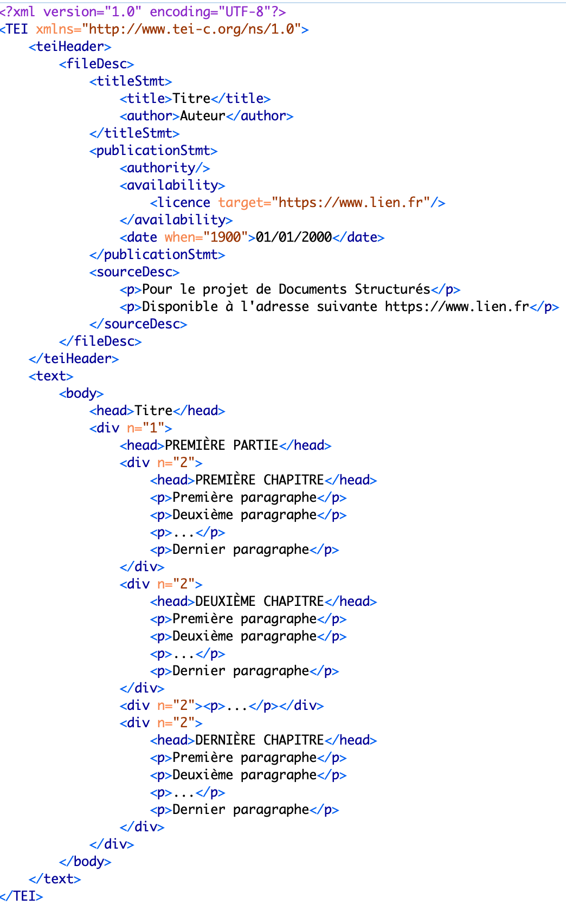

# projet-documents-structures

L’objectif de ce projet est de réaliser une chaîne de traitement pour la publication de documents en ligne. À partir de documents qui vous seront fournis, vous allez devoir proposer un site web pour présenter le contenu de ces documents et interagir avec.
Deux grandes étapes seront mises en œuvre.
La première étape consistera à transformer les documents au format OpenDocument en document XML selon le standard de la Text Encoding Initiative (TEI). Pour cela, son schéma vous sera communiqué afin de vous permettre de valider la structure. De plus, un Schematron vous permettra de respecter l’encodage attendu de certaines métadonnées.
Une fois cette étape terminée, les documents seront stockés dans une base de données XML (eXist- db). À partir de celle-ci, vous allez devoir réaliser un site internet à l’aide de xquery et xslt. Sur ce site seront présentées trois interfaces : une pour la recherche d’informations dans les documents, une autre pour afficher vos documents mis en page et finalement une page pour présenter le projet.

## Partie 1

Transformation des documents du format OpenDocument en XML via XSLT. 

### Utilisation

Pour transformer des ODTs en XMLs il ne faut qu'exécuter un script ```bonus.sh```. Pourtant, assurez-vous que vous avez installé des utilitaires [Saxon](http://saxon.sourceforge.net/) et [unzip](http://infozip.sourceforge.net/UnZip.html).
Pour OS X : 


```
brew install unzip
brew install saxon
```

### Résultats

Voici un exemple du document XML final.

